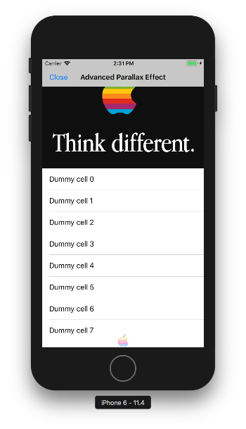

# Parallax effect for header and footer
Implementing that effect for table view header and footer. To create effect we  should manually update constraints in **layoutSubviews** method. Image view should have aspect fill mode.  



## Footer
We should consider two cases: when content size height of table view is less or equal than screen height (in points) and when content size height is bigger than screen height.
``` swift
if self.contentSize.height + 100 <= UIScreen.main.bounds.height {  // 100 - self footer height
    let offsetFooter = contentOffset.y + 64  // 64 - height of navigation and status bars
    heightFooterConstraint?.constant = offsetFooter < 0 ? offsetFooter / 15 : 0  // 15 - to slightly up the footer when table scrolled down divide offset by coefficient
    bottomFooterConstraint?.constant = -offsetFooter / 2  // 2 - when table scrolled up scale footer image for coefficient
    footerImageView.alpha = offsetFooter >= 0 ? 1 : 30 / abs(offsetFooter)  // 30 - to slightly change alpha by using coefficient
} else {
    let offsetFooter = contentOffset.y
    let zeroBottomMark = self.contentSize.height - UIScreen.main.bounds.height - offsetFooter
    heightFooterConstraint?.constant = zeroBottomMark > 0 ? -zeroBottomMark / 5 : 0  // 5 - to slightly up the footer when table scrolled down divide offset by coefficient
    bottomFooterConstraint?.constant = zeroBottomMark < 0 ? zeroBottomMark / 2 : zeroBottomMark  // 2 - when table scrolled up scale footer image for coefficient
    footerImageView.alpha = zeroBottomMark <= 0 ? 1 : 30 / abs(zeroBottomMark)  // 30 - to slightly change alpha by using coefficient
}
```

Also, to avoid Auto Layout issues make bottom constraint priority equal *999*.  
In some cases can be used clip to bounds for an image:
``` swift
    footer.clipsToBounds = zeroBottomMark > 0 ? true : false
``` 

## Header
Will be later.
